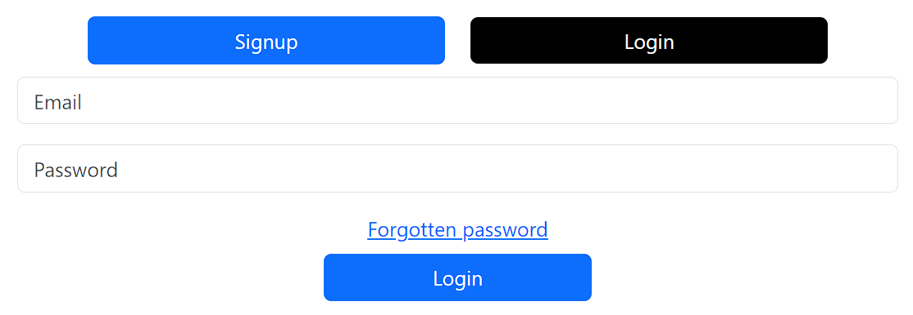
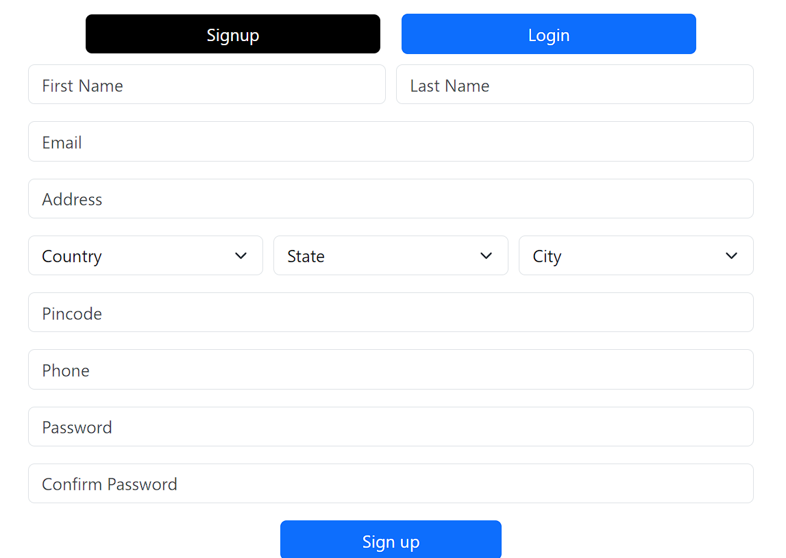

# Shopping Cart app using React app

## Following setup with signup, login and the combined LoginSignup pages

Login page 

Signup page

These two embedded in LoginSignup page;
`
    

        

            <button className='btn btn-primary ls_btn' onClick={handleSignupClick} style={signupBtnStyle}>Signup</button>
            <button className='btn btn-primary ls_btn' onClick={handleLoginClick} style={loginBtnStyle}>Login</button>
        

        
{state}

    

`
