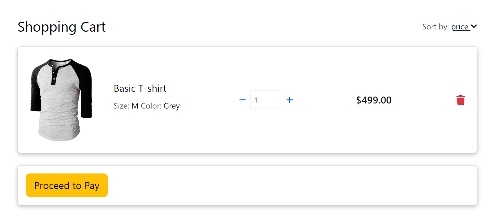

# Ecommerce app using ReactJs

### Websites used
[MDBootstrap for templates](https://mdbootstrap.com//)
[Bootstrap5](https://getbootstrap.com//)
[FontAwesome](https://fontawesome.com//)

### APIs
[Countries, States and Cities](https://www.universal-tutorial.com/)
[Product store](https://fakestoreapi.com/products/)

### Here's the UI 

### Something Important!
I have used localstorage the save the data and with the help of local storage I am able to get the data properly while login. 
I am only using ReactJs not backend and databases.